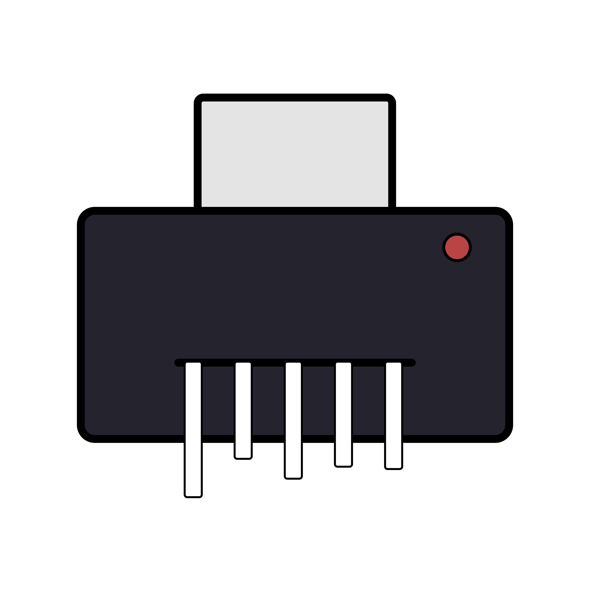

<div id="top"></div>
<!--
*** Thanks for checking out the Best-README-Template. If you have a suggestion
*** that would make this better, please fork the repo and create a pull request
*** or simply open an issue with the tag "enhancement".
*** Don't forget to give the project a star!
*** Thanks again! Now go create something AMAZING! :D
-->


<!-- PROJECT SHIELDS -->
<!--
*** I'm using markdown "reference style" links for readability.
*** Reference links are enclosed in brackets [ ] instead of parentheses ( ).
*** See the bottom of this document for the declaration of the reference variables
*** for contributors-url, forks-url, etc. This is an optional, concise syntax you may use.
*** https://www.markdownguide.org/basic-syntax/#reference-style-links
-->
[![Contributors][contributors-shield]][contributors-url]
[![Forks][forks-shield]][forks-url]
[![Stargazers][stars-shield]][stars-url]
[![Issues][issues-shield]][issues-url]
[![MIT License][license-shield]][license-url]
[![LinkedIn][linkedin-shield]][linkedin-url]


<!-- PROJECT LOGO -->
<br />
<div align="center">
  <a href="https://github.com/jemhop/shred">
    
  </a>

<h3 align="center">shred</h3>

  <p align="center">
    An intuitive CLI to delete files
</div>


<!-- TABLE OF CONTENTS -->
<details>
  <summary>Table of Contents</summary>
  <ol>
    <li>
      <a href="#about-the-project">About this project</a>
      <ul>
        <li><a href="#why">Why</a></li>
        <li><a href="#a-little-warning">A little warning</a></li>
        </ul>
    </li>
    <li><a href="#usage">Usage</a></li>
    <li>
      <a href="#getting-started">Getting Started</a>
      <ul>
        <li><a href="#prerequisites">Prerequisites</a></li>
        <li><a href="#installation">Installation</a></li>
      </ul>
    </li>
    <li><a href="#license">License</a></li>
  </ol>
</details>


<!-- ABOUT THE PROJECT -->
## About this project

[![Product Name Screen Shot][product-screenshot]](https://example.com)

### Why

There are many ways to delete files from the terminal, but *most* give little feedback or are generally not intuitive. I decided to make a trash compatible tool for my own usage. **It also has the ability to delete files unrecoverable by overwriting them with random data before deleting.** 

*(As of right now, I read from /dev/urandom, but I'm looking into if there is a faster alternative.)*

### A little warning

This project is very work in progress. I wouldn't show this code to my mother. Right now, I've barely tested how it behaves around files with different permissions, but as I use it daily it'll slowly improve.


<p align="right">(<a href="#top">back to top</a>)</p>


<!-- USAGE EXAMPLES -->
## Usage

Use this space to show useful examples of how a project can be used. Additional screenshots, code examples and demos work well in this space. You may also link to more resources.

_For more examples, please refer to the [Documentation](https://example.com)_

<p align="right">(<a href="#top">back to top</a>)</p>


<!-- GETTING STARTED -->
## Getting Started

This is an example of how you may give instructions on setting up your project locally.
To get a local copy up and running follow these simple example steps.

### Prerequisites

This is an example of how to list things you need to use the software and how to install them.
* npm
  ```sh
  npm install npm@latest -g
  ```


<!-- LICENSE -->
## License

Distributed under the MIT License. See `LICENSE.txt` for more information.

<p align="right">(<a href="#top">back to top</a>)</p>


<!-- MARKDOWN LINKS & IMAGES -->
<!-- https://www.markdownguide.org/basic-syntax/#reference-style-links -->
[contributors-shield]: https://img.shields.io/github/contributors/jemhop/shred.svg?style=for-the-badge
[contributors-url]: https://github.com/jemhop/shred/graphs/contributors
[forks-shield]: https://img.shields.io/github/forks/jemhop/shred.svg?style=for-the-badge
[forks-url]: https://github.com/jemhop/shred/network/members
[stars-shield]: https://img.shields.io/github/stars/jemhop/shred.svg?style=for-the-badge
[stars-url]: https://github.com/jemhop/shred/stargazers
[issues-shield]: https://img.shields.io/github/issues/jemhop/shred.svg?style=for-the-badge
[issues-url]: https://github.com/jemhop/shred/issues
[license-shield]: https://img.shields.io/github/license/jemhop/shred.svg?style=for-the-badge
[license-url]: https://github.com/jemhop/shred/blob/master/LICENSE.txt
[linkedin-shield]: https://img.shields.io/badge/-LinkedIn-black.svg?style=for-the-badge&logo=linkedin&colorB=555
[linkedin-url]: https://linkedin.com/in/linkedin_username
[product-screenshot]: images/screenshot.png
